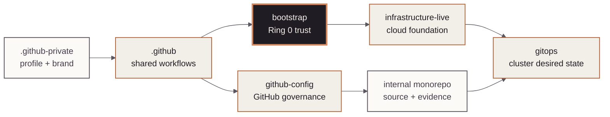

<!-- mindclade-doc: repository-home@2 -->
<!-- Brand source: mindclade/.github-private/mindclade-brand-assets (MONO family). -->

<p align="center">
  <picture>
    <source media="(prefers-color-scheme: dark)" srcset="docs/assets/brand/mono-wordmark-dark-1080w.png">
    <source media="(prefers-color-scheme: light)" srcset="docs/assets/brand/mono-wordmark-1080w.png">
    
  </picture>
</p>

<p align="center">
  
  
  
  
</p>

# Mindclade · Bootstrap

> **Platform Foundation · Ring 0**
> Establish the durable state, initial trust, and recovery controls required to rebuild the
> rest of the Mindclade platform.

| Repository contract | Value |
| --- | --- |
| Class | `enterprise-control` |
| Visibility | `private` |
| Change model | `pull-request` |
| Authority | `ring0-state`<br>`automation-federation`<br>`seed-projects`<br>`break-glass-recovery` |
| Primary readers | Platform and security engineers |
| First success | [Validate Ring 0 source](#quick-start) |
| Start here | [`docs/README.md`](docs/README.md) |

## Mission

`bootstrap` owns the smallest independently recoverable cloud foundation. Platform and
security engineers use it to establish state storage, automation federation, seed projects,
and audited break-glass access before any normal-plane infrastructure exists.

## Authority boundary

### This repository creates

- Protected primary and replica state storage with compatible encryption and retention.
- Seed projects, repository-isolated automation identities, and GitHub federation for ARC.
- Recovery identities and alerts that carry no standing operational access.

### This repository deliberately does not create

- Normal folders, organization policy, networks, workload projects, managed services, or GKE;
  those belong to `infrastructure-live`.
- Argo CD or Kubernetes desired state; those belong to `gitops`.
- Application, model, training, or reusable module source; those belong to the monorepo.

## Quick start

Prerequisite: Nix with flakes enabled. The source checks require no Google Cloud credentials and
do not read or modify remote state.

```sh
nix develop .#ci --command make validate
nix flake check --no-update-lock-file
```

**Success means:** Terraform, WIF policy, local-state, repository-contract, formatting, and
license checks all pass.

**If it fails:** fix the first named check. Never bypass a local-state or WIF-policy failure;
use the [documentation home](docs/README.md) to locate the owning recovery or trust procedure.

**Safety boundary:** do not run an apply, state migration, or break-glass action from an ordinary
development session. Use the reviewed procedures linked below.

## Estate position

The highlighted node is this repository. The table and boundary lists above are the text
equivalent of the cross-repository authority flow.



## Repository map

| Path | Purpose |
| --- | --- |
| `modules/state/` | State buckets, encryption, retention, replication, and IAM. |
| `modules/identity/` | Federation, automation identities, and break-glass controls. |
| `modules/projects/` | Bootstrap folder, seed/state project, and federation project. |
| `contracts/` | Output schemas and repository authority. |
| `.github/workflows/` | Validation, exact-plan apply, drift, and recovery drills. |
| `docs/` | First apply, handoff, recovery, and credential procedures. |

## Change path

Changes move through a reviewed pull request and credential-free validation. First apply,
state migration, subsequent exact-plan apply, and recovery each use protected workflows and
their dedicated approval path. Begin with the [first-apply guide](docs/first-apply.md); preserve
state and trust rollback instructions with every material change.

## Documentation and support

- [Documentation home](docs/README.md)
- [Architecture](docs/architecture.md)
- [First apply](docs/first-apply.md)
- [Break glass](docs/break-glass.md)
- [State recovery](docs/state-recovery.md)
- [Contributing](CONTRIBUTING.md)
- Policies and terms: [governance](GOVERNANCE.md) · [conduct](CODE_OF_CONDUCT.md) ·
  [support](SUPPORT.md) · [legal](LEGAL.md) · [license](LICENSE) · [notice](NOTICE) ·
  [changes](CHANGELOG.md)

## Security

Never commit state, plan files, credentials, private keys, sensitive outputs, or production
variables. Report vulnerabilities through [the private security process](SECURITY.md).
