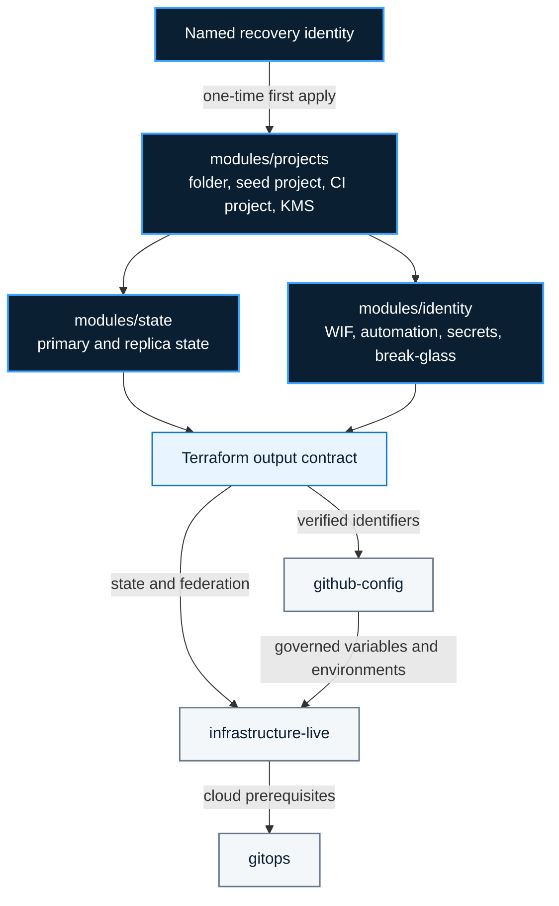

<!-- mindclade-doc: architecture@1 -->

# Mindclade · Bootstrap architecture

> **Audience:** Platform, infrastructure, security, and recovery operators
> **Outcome:** Understand the Ring-0 boundary, dependency direction, identity handoff, and
> state recovery model before changing bootstrap resources.

## Context

`bootstrap` exists so the normal control plane can be created and recovered without depending
on itself. It owns the smallest durable Google Cloud foundation required to store Terraform
state, federate trusted automation, create seed projects, and activate audited emergency
access.

Everything that can safely live above Ring 0 does. Normal organization governance belongs to
`infrastructure-live`; GitHub desired state belongs to `github-config`; Kubernetes desired
state belongs to `gitops`.

## Authority boundary

### Owns

- the bootstrap folder and seed/state and CI-federation projects;
- primary and independently located replica Terraform state buckets and CMEKs;
- repository-isolated GitHub Actions WIF providers and optional Buildkite federation;
- the signer-only monorepo trust condition and exact signer principal handed to
  `infrastructure-live`;
- plan/apply identities required to bring up higher control repositories;
- the empty private-module-reader secret container; and
- a no-standing-permission break-glass account with audit alerting.

### Delegates

- normal folders, organization policy, logging, SCC, networks, projects, and workloads to
  `infrastructure-live`;
- repositories, teams, rulesets, environments, and GitHub policy to `github-config`; and
- Argo CD and cluster desired state to `gitops`.

### Explicitly excludes

- ordinary application infrastructure, Kubernetes resources, product source, and secret
  payload versions; and
- artifact signer accounts, KMS signing keys, Binary Authorization attestors, and their roles.

## Component model

The diagram shows Ring-0 creation, its supported output contract, and downstream control-plane
handoffs.

| Component | Responsibility | Source of truth |
| --- | --- | --- |
| Naming | Stable random suffix used by globally named resources | `modules/naming/` |
| Seed projects | Folder/project creation, APIs, KMS, and audit configuration | `modules/projects/` |
| Identity | WIF, repository identities, service accounts, module-reader container, and break-glass | `modules/identity/` |
| State | Versioned, soft-deleted, CMEK-protected primary and replica buckets | `modules/state/` |
| Consumer contract | Non-secret identifiers exported to higher layers | `outputs.tf`, `contracts/outputs.schema.json` |

## Creation and handoff flow

1. A named recovery operator performs the one-time local-state apply described in
   [First apply](first-apply.md).
2. Terraform creates seed resources, federation, identities, state protection, and replication.
3. The operator migrates state into the new bootstrap bucket and verifies a no-change plan.
4. The private-module reader's first secret version is injected directly into Secret Manager;
   Terraform owns only the empty container and IAM.
5. `github-config` publishes verified non-secret output identifiers as repository variables.
6. Protected workflows use separate plan and apply identities for all normal later changes.
7. `infrastructure-live` grants environment identities their normal scoped authority after
   the matching folder hierarchy exists.

The supported machine boundary is Terraform output. Consumers must not read bootstrap state or
implementation paths directly.

## Trust and security boundaries

- Human recovery access requires a named identity protected by phishing-resistant MFA.
- Automation uses GitHub OIDC and WIF; service-account JSON keys are prohibited.
- WIF providers are repository-isolated and bind immutable GitHub identity claims.
- The monorepo GitHub provider accepts only the protected `release` subject executing the
  released `reusable-binauthz-sign.yml@v3.0.0`; builders use separate Buildkite trust.
- Plan, drift, bootstrap apply, GitHub governance, and infrastructure apply are separate
  service accounts with distinct authority.
- The break-glass account has no standing organization role. Temporary grants are conditional,
  time-bound, alerted, explicitly revoked, and reviewed.
- Terraform creates Secret Manager containers but never secret payload versions.

## State and recovery model

The primary state object is protected by narrow IAM, native locking, versioning, soft delete,
CMEK, and lifecycle controls. An independent cross-location replica provides a separate
recovery source and may lag by one transfer interval.

Recovery proceeds from least invasive to most invasive:

1. inspect and restore a prior primary-bucket generation;
2. recover an independently replicated object and import any later resources; or
3. reconstruct state from live resources using reviewed Terraform import blocks.

Never apply against missing or partial state. See [State recovery](state-recovery.md).

## Failure domains

| Failure | Impact | Recovery source |
| --- | --- | --- |
| GitHub/WIF outage | Protected automation cannot authenticate | [Break-glass](break-glass.md) and WIF recovery |
| Primary state corruption | Ring-0 plans are unsafe | Prior generation or replica in [State recovery](state-recovery.md) |
| Seed project or KMS damage | State and trust may be unavailable | Break-glass plus reconstruction from live resources |
| Higher-layer loss | Normal cloud or cluster control is unavailable | [Cold-start recovery](cold-start.md) in dependency order |

## Invariants

- Ring 0 remains smaller than the normal infrastructure control plane.
- The first apply is the only supported local-state apply.
- State recovery never depends on GKE, Argo CD, Cloud SQL, or an application workload.
- Consumers use outputs, not direct state reads.
- Break-glass has no standing organization permission.
- No secret payload passes through Terraform state.

## Related documentation

- [Documentation home](README.md)
- [First apply](first-apply.md)
- [State recovery](state-recovery.md)
- [Break-glass](break-glass.md)
- [Automation identity handoff](https://github.com/mindclade/infrastructure-live/blob/main/docs/automation-identity-handoff.md)
