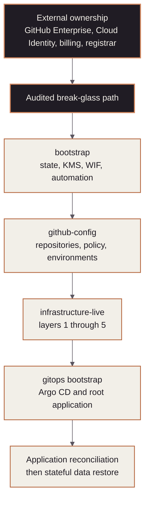

<!-- mindclade-doc: runbook@1 -->

# Cold-start platform recovery

> **Use when:** The control plane must be rebuilt from source and durable external state.
> **Impact:** GitHub governance, cloud infrastructure automation, clusters, or applications may
> be unavailable.
> **Primary owner:** `@platform` with `@security` oversight
> **Escalate:** Declare a critical incident before any break-glass grant or state mutation.

## Safety rules

- Recovery must not depend on GKE, Argo CD, Cloud SQL, or an application workload.
- Stop all surviving apply/deploy automation before restoring state or trust.
- Preserve state generations, audit logs, failing revisions, and resource identifiers.
- Recover in dependency order; never allow two repositories to manage one resource.
- Use an isolated workstation or ephemeral VM with the pinned toolchain.

## Recovery order

The diagram shows the only supported cold-start sequence, from externally owned control to
application reconciliation.

Do not skip a stage because a higher layer appears reachable. A surviving runtime may contain
stale or unauthorized state.

## Prerequisites

- An incident or disaster-recovery identifier and named incident commander.
- At least one qualified operator and, when staffing permits, an independent watcher.
- Recovery ownership for GitHub Enterprise, the corporate identity provider, Google Cloud
  organization and billing, and the Squarespace registrar.
- Access to the approved operations vault and source repositories.
- A clean environment with the repository-pinned Nix/toolchain configuration.

## Recover external control

1. Restore strongly authenticated ownership of GitHub Enterprise, Cloud Identity, billing,
   and the registrar.
2. Revoke unexplained sessions or credentials before using recovered control planes.
3. Record the identities performing recovery and independently verify organization/project
   identifiers against retained evidence.
4. Activate [Break-glass](break-glass.md) only when the ordinary recovery identity cannot
   proceed. Grant the narrowest conditional role and start the revocation timer immediately.

Checkpoint: recovery operators can read source and audit evidence, and no unreviewed automation
is mutating the estate.

## Recover Ring 0

1. Locate the primary and replica bootstrap state buckets from retained recovery evidence.
2. Follow [State recovery](state-recovery.md) to copy a candidate generation into an isolated
   file or prefix and validate its JSON.
3. Compare the candidate with Cloud Audit Logs and live-resource inventory.
4. Restore the authoritative state only after an independent review.
5. Run a read-only plan. Resolve every difference before any apply.
6. Recover WIF providers, automation service accounts, state replication, and break-glass
   monitoring through a reviewed bootstrap change.

Checkpoint: the bootstrap remote-state plan is empty, replication is healthy, allowed WIF
preflight succeeds, and negative authorization tests fail as designed.

## Recover higher control repositories

1. Recover `github-config`, importing existing GitHub objects before apply and leaving manual
   enterprise controls explicit.
2. Rebuild `infrastructure-live` in numeric layer order: `1-org`, `2-environments`,
   `3-networks`, `4-projects`, then `5-workloads`.
3. Verify each layer's state and outputs before releasing the next layer. Do not run a broad
   apply across a partially recovered graph.
4. Restore cluster and cloud prerequisites before touching GitOps.

Checkpoint: GitHub drift is clean; infrastructure plans are classified and understood; cloud
identity, network, cluster, storage, backup, and admission prerequisites are healthy.

## Recover GitOps and applications

1. Verify the vendored Argo CD manifest checksum in `gitops/bootstrap`.
2. Run the GitOps bootstrap script with the exact expected cluster context and qualified
   profile.
3. Confirm the environment root application reconciles projects and policy before workloads.
4. Let Argo CD reconcile the reviewed immutable desired state.
5. Restore stateful application data from its authoritative backup system only after workload
   identity, storage, and policy are healthy.

Checkpoint: Argo CD is healthy, desired state is synchronized, policy tests pass, images are
digest-pinned with complete release evidence, and application health checks pass.

## Verify recovery

- Revoke every temporary grant explicitly; do not rely on expiry.
- Rotate any recovery material exposed during the incident.
- Preserve an incident timeline, state generations, plan classifications, applied revisions,
  and verification evidence in the approved system.
- Open reviewed changes for every code, test, alert, or documentation gap discovered.
- Run or update the [scratch-organization drill](../test/scratch-org-drill.md).

## Escalation and handoff

At every stage boundary, hand the next owner the incident ID, authoritative commits, state
generations, account and cluster identities, plans, mutations, verification evidence, exposed
material, and unresolved risk. Stop the sequence when ownership or evidence is ambiguous; the
incident commander decides whether to hold, roll back, or authorize reviewed forward recovery.

## Qualification record

Do not invent a recovery-time objective before the procedure has been timed end to end. Record
each drill and use the latest successful independent drill as the operational baseline.

| Date | Operator | External control | Ring 0 | GitHub governance | Cloud layers | GitOps/apps | Total | Findings |
| --- | --- | --- | --- | --- | --- | --- | --- | --- |
| Not yet qualified | — | — | — | — | — | — | — | First independent drill required |
